### Theory

The Zeeman effect is a phenomenon that occurs when a magnetic field (B) is applied to a material and splits the spectral lines of an atom or molecule. This splitting of spectral lines occurs due to the interaction of the magnetic field with the electrons of the atom or molecule. The theory behind the Zeeman effect is based on the interaction of the magnetic field with the magnetic moment () of the electrons. The magnetic moment of an electron is proportional to its angular momentum and is caused by the intrinsic angular momentum (spin) of the electron and its orbital angular momentum. In the presence of a magnetic field, the energy levels of the electrons are shifted due to the interaction of the magnetic field with the magnetic moment of the electrons. This interaction causes the energies of the electrons to split into two or more separate energy levels. The separation between the energy levels is proportional to the strength of the magnetic field. When the electrons in an atom or molecule transition between these energy levels, they emit or absorb light, resulting in the characteristic spectral lines of the atom or molecule. The presence of a magnetic field causes the spectral lines to split into several separate lines, which is known as the Zeeman effect.

The Zeeman effect has many applications in various fields, including atomic spectroscopy, magnetic resonance imaging (MRI), and the study of magnetic fields in stars and other astronomical objects.

The potential energy of orientation 

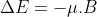 ....................(1)

 

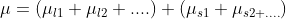

 

 

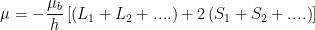

Here, L1, L2,... are orbital angular momenta and S1,S2....are spin angular momenta of active electrons,  μb = eh/2mc is Bohr Magneton, and gl and gs are orbital and spin g factors.

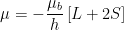 …………………. (2)

Total magnetic moment of the atom is not antiparallel to its total angular momentum

 ……………………… (3)

μ processes about J with a precessional frequency which is proportional to the strength of the internal magnetic field of the atom. The result is that the average value of μ which is the component μJ of μ along the direction of J enters in Eq.1 for ∆E

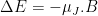 …………………... (4)

The component μJ is given by

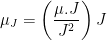

 

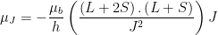

 

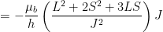

 

			
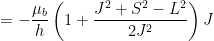

 

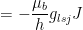 …………………… (5)

As 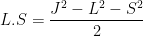

The factor glsj is called Lande’s g-factor and is given by 

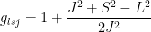

 

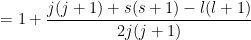………… (6)

Where l, s, and j are respectively the values of orbital, spin and total angular momenta in the state characterized by L, S, and J.

The potential energy of interaction in an external magnetic field B is now given by

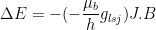

 

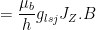

 

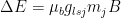 ………………..(7)

taking along z-axis along B and Jz = mj ℏ

thus an energy level characterized by L, S, and J will get split up into (2j+1) sub levels corresponding to mj=-j , -(j-1),-(j-2)........,(j-1),j with energy separation between the adjacent sublevels given by μbglsjB

An optical transition can take place between any two levels provided

 

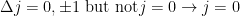

 

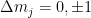

Let us consider the transition corresponding to the 546.1 nm prominent green line of mercury spectrum with which we are concerned here. This line arises from a transition between the 3S1(6s7s) state to 3p2(6s6p) state.

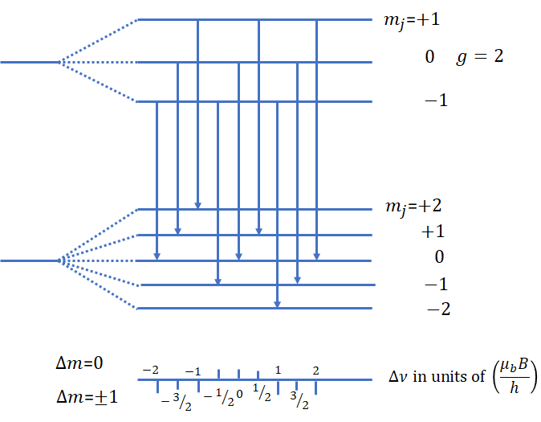

Figure 1: Structure of Zeeeman multiplet arising in a transition from 3S1to 3p level; the mercury green line at 5461A is an example of such a transition.

Figure.1 shows the energy diagram for these two states without and with a magnetic field. The upper level gets split into three corresponding to mj=1,0, -1, and the lower into five corresponding to mj= 2,1,0,-1 and -2. The g-factors for the upper and lower states are

3S1(J=1, L=0, S=1)&nbsp;&nbsp;&nbsp;&nbsp;&nbsp;&nbsp;&nbsp;&nbsp;&nbsp;&nbsp;&nbsp;&nbsp;&nbsp;&nbsp;&nbsp;&nbsp;&nbsp;&nbsp;&nbsp;&nbsp;&nbsp;&nbsp;&nbsp;&nbsp;g=2

3P2(J=2, L=1, S=1)&nbsp;&nbsp;&nbsp;&nbsp;&nbsp;&nbsp;&nbsp;&nbsp;&nbsp;&nbsp;&nbsp;&nbsp;&nbsp;&nbsp;&nbsp;&nbsp;&nbsp;&nbsp;&nbsp;&nbsp;&nbsp;&nbsp;g=3/2

As shown in Figure.1, in the presence of the magnetic field, the 546.1 nm line gives rise to nine components. This is because of different g-factors for the initial and final states. This is a case of the anomalous Zeeman effect.

When viewed in the transverse geometry, (i) the first group where ∆mj=-1 gives - lines whose light is polarized perpendicular to the magnetic field, (ii) the middle group where ∆mj=0 gives -lines whose light is polarized parallel to the direction of the field and (iii) the last group where ∆mj=1 gives – lines whose light is again polarized perpendicular to the magnetic field.

In the longitudinal geometry where the light beam is along the direction of the magnetic field, the beam corresponding to -lines (has electric vector along the direction of the magnetic field) cannot travel as light waves are transverse electromagnetic waves. The beam corresponding to -lines is therefore not observed. The beam corresponding to six  – lines is circularly polarized when viewed in the longitudinal direction, the three components corresponding to ∆mj=1 as left circularly polarized.The shift in frequencies of these nine lines is in the lower part of Figure 1 in units of  μb/h. We are interested in the three -lines for the measurement of Bohr magneton and use transverse geometry. These are picked up by a polarizer whose pass direction is kept parallel to the direction of the magnetic field. The – lines which are polarized perpendicular to the magnetic field get blocked. The frequencies of these three -lines are

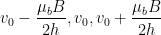 ------------(8)

This frequency shift ∆υ= μbB/2h= eB/8πm is measured in this experiment. As this is very small, a high-resolution device, a Fabry Perot etalon, based on multiple beam interferometry is used. The Fabry Perot etalon consists of two optically flat (to within 20 nm) glass plates coated on the inner surface with a partially transmitting metallic layer (reflection coefficient 0.95) (Figure 2). 

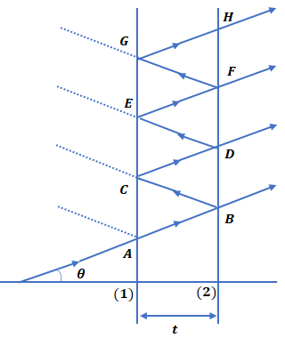

Figure 2:  reflected and transmitted rays at the two parallel surfaces (1) and (2) of a Fabry Perot etalon. The etalon spacing is t.

The outer surface is slightly inclined (about 0.10) with respect to the inner one, to avoid multiple reflections. The plates are arranged in a holder and held apart (with spacing t) by three very accurately machined spacers. Three spring-mounted screws are used to apply pressure, and by careful adjustment, the plates are made parallel. 

An almost parallel beam from an extended source at the focus of a lens falls on the etalon. The emerging parallel rays B. D. F, etc, are brought to focus by the use of a good quality lens of focal length f, as shown in Figure 3.

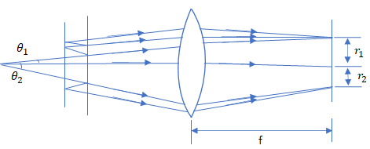

Figure 3: Focusing the light emerging from a Fabry Perot etalon. Light entering the etalon at an angle  is focused onto a ring of the radius fθ where f is the focal length of the lens.

Light entering the etalon at an angle θ is focused onto a ring of radius fθ. When θ satisfies the condition,

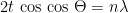

With n an integer, a bright ring will appear in the focal plane with the radius being given by

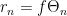

The order n, corresponding to the interference at the center is 2t/λ.n0 is in general not an integer.

Now 

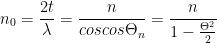

since θn is small.This leads to

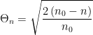

And

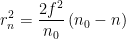 --------------(9)

The order of the first bright ring counting from the center is less than n0, since n1=n0cos θ1. 

Let us take n1 = n0 – ε with fractional order ε lying between zero and one. In general, for the pth ring of the pattern as measured from the center.

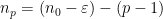

 
Or

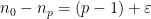----------(10)

 From Eqs. (9) and (10) we obtain for the square of the radius of the pth ring 

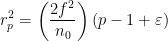----------(11)

and the difference between the squares of the radii of adjacent rings

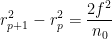----------(12)

This difference is constant. The squares of the radii of successive rings are linearly related and form an arithmetic progression.

Now if there are two components of a spectral line (in the present experiment, we have three components) with wavelengths λaand λb very close to one another, their fractional orders at the center will be given by

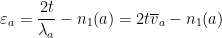

 

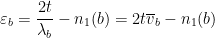

Here,  and  are wave numbers, and n1(a) and n1(b) are orders of the first rings. As the wavelengths are very close, n1(a)= n1(b). The difference in wave numbers between the two components is, therefore:

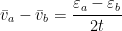----------(13)

The fractional order  can be obtained using Eq. (11)

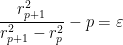----------(14)

Consider a line which has three components (as in the present experiment) a, b, c, and let the respective radii be r1a, r2a, r3a, ...., for component a; r1b, r2b, r3b, ....,  for component b and similarly for component c. From Eq. (12), it is clear that the difference between the squares of the radii of any two adjacent rings of component a

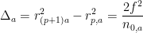

 

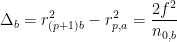

is equal (to within a very small amount) to the similar difference for component b or any other component of the same line. We shall take the average of these. Let these differences be designated by A. Eq.(14) now leads to

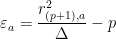

 

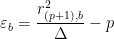

 

and the required separation (in wave numbers) between the two components, a and b, using Eq.(13), is given by

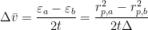----------(15)

The difference 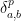 between the squares of the radii of the pth rings of components a and b is found to be independent of p. We shall take the average of these. Let these be designated by δ. The required separation between the two components is finally given by

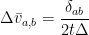----------(16)

As the result depends on the ratio of δab/∆, the dimensions used in measuring the radii of the ring system or the amplification of the interference pattern do not matter. Using this wave number separation in Eq. 8 for the Zeeman line splitting, we get

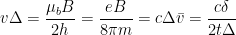

or

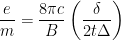----------(16)

Average values of ∆ and δ are required.